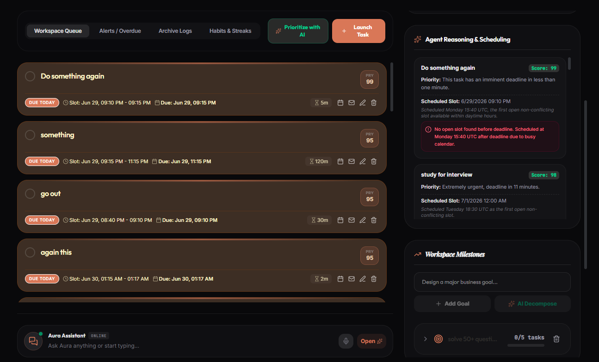
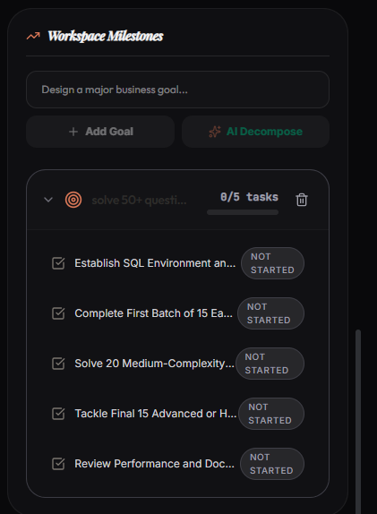
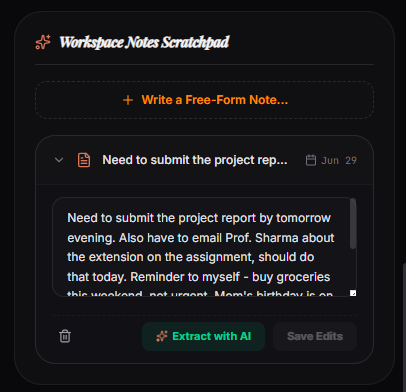
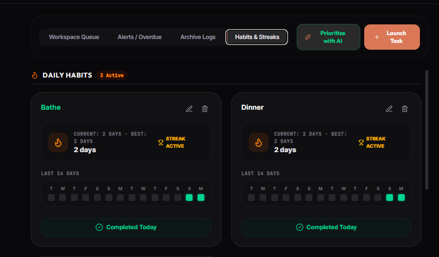

# Aura Workspace

**Vibe2Ship Hackathon Submission | Problem Statement: "The Last-Minute Life Saver"**

[](https://aistudio.google.com/)
[](#)
[](#)
[](#)

Aura Workspace is an AI-powered productivity companion designed to solve the critical flaw in modern task management: passive reminders. When deadlines loom, simply notifying a user that a task is overdue doesn't help them accomplish it; it just creates anxiety. Aura steps in as a proactive agent. When you fall behind, it doesn't just ping you — it automatically detects missed deadlines, re-evaluates your priorities, intelligently reschedules the work around your existing Calendar commitments, and can even draft a Gmail update to your stakeholders explaining the delay. It's not just a to-do list; it's a "Last-Minute Life Saver" that actively manages your time when you can't.

---

## 🤖 Why This is Truly Agentic

Aura Workspace isn't just a UI wrapper around an LLM chat prompt. It features a genuine, multi-step autonomous agent loop that executes physical actions on your behalf:

*   **The Autonomous Recovery Loop**: When the system detects an overdue task, the Aura Agent autonomously triggers. It analyzes the missed deadline, re-prioritizes your remaining workload, finds a new time slot, and physically updates your Google Calendar to reflect the new reality.
*   **Context-Aware Action Execution**: If a missed task looks like it involves other people (e.g., "Send Q3 report to Sarah"), the agent doesn't just reschedule it—it drafts a contextual Gmail message to the stakeholders, staged and ready for your approval.
*   **Transparent Decision-Making**: The UI features a dedicated **"Agent Reasoning"** panel. Whenever the AI reprioritizes your queue or takes an action, it logs its exact logical steps, ensuring you remain in control and understand *why* the agent made a specific scheduling choice.

---

## ✨ Core Features

### 🎯 Intelligent Prioritization & Scheduling
*   **AI-Driven Queue**: Gemini evaluates your tasks based on effort, deadline, and context, organizing your day dynamically.
*   **Calendar Auto-Scheduling**: The agent finds available time slots and automatically schedules blocks of work on your Google Calendar.
*   **Proactive Re-planning**: Missed a deadline? The system automatically shifts your schedule and re-prioritizes to keep you afloat.

### 🧠 Smart Goal & Note Management
*   **AI Goal Decomposition**: Enter a massive, vague milestone ("Launch marketing campaign"). Aura uses Gemini to break it down into actionable, sequential sub-tasks.
*   **Notes-to-Task Extraction**: Jot down unstructured meeting notes in the scratchpad. Aura automatically scans the text, extracts actionable items, and converts them into tracked tasks.

### 📈 Habit Tracking & Analytics
*   **Habits & Streaks**: Visual GitHub-style contribution graphs track your daily recurring habits.
*   **Productivity Dashboard**: Real-time analytics on completion rates, overdue trends, and effort distribution.

### 🎙️ Multi-Modal Input & Control
*   **Voice Input**: Voice dictation for quick task entry.
*   **Archive/Restore**: Full lifecycle management with a safe archive and restore system.

---

## 🛠️ Google Technologies Used

Aura Workspace deeply integrates with the Google ecosystem to provide a seamless, agentic experience:

*   **Gemini API (Google Gen AI SDK)**: The brains of the operation. Used for complex reasoning, task prioritization, semantic goal decomposition, and extracting structured tasks from unstructured notes.
*   **Google Calendar API**: Enables two-way synchronization. Aura reads your availability to avoid double-booking and writes scheduled work blocks directly to your calendar.
*   **Gmail API**: Allows the agent to construct and stage draft emails (e.g., delay notifications) directly in your Gmail account.
*   **Firebase / Firestore**: Provides real-time, durable cloud persistence for tasks, goals, notes, and habits, along with secure user authentication.
*   **Google AI Studio**: The entire application architecture, UI, and logic were generated iteratively using Google AI Studio's Build mode.

---

## 🏗️ Architecture Overview

The system operates on a Full-Stack architecture with a React client and an Express/Node.js backend:

1.  **State Management**: The React frontend maintains the state of Tasks, Goals, and Notes, syncing in real-time with Firestore.
2.  **Agent Triggering**: User actions (or time-based overdue checks) trigger requests to the backend `/api/*` routes.
3.  **Reasoning Engine**: The Express backend securely calls the Gemini API with the current workspace context (tasks, calendar state) to determine the next optimal action.
4.  **Action Execution**: Based on Gemini's output (using Structured Outputs/Function Calling), the backend executes OAuth calls to Google Workspace APIs (Calendar/Gmail) to manifest those decisions in the real world.

---

## 📸 Screenshots

*(Replace placeholders with actual screenshot paths before submission)*

| Workspace Queue & Agent Reasoning | AI Goal Decomposition |
| :---: | :---: |
| <br>_The dynamic task queue with the transparent Agent Reasoning log._ | <br>_Breaking down a high-level goal into actionable, scheduled subtasks._ |

| Notes Extraction | Habit Tracking & Analytics |
| :---: | :---: |
| <br>_Unstructured notes automatically parsed into tracked tasks._ | <br>_Visualizing streaks and tracking productivity momentum._ |

---

## 🚀 Setup & Run Instructions

### Prerequisites
*   Node.js (v18+)
*   A Gemini API Key (from Google AI Studio)
*   A Google Cloud Project with Calendar API and Gmail API enabled (for OAuth)
*   A Firebase Project with Firestore enabled

### Installation

1.  **Clone the repository:**
    ```bash
    git clone https://github.com/your-username/aura-workspace.git
    cd aura-workspace
    ```

2.  **Install dependencies:**
    ```bash
    npm install
    ```

3.  **Configure Environment Variables:**
    Create a `.env` file in the root directory and add your credentials:
    ```env
    GEMINI_API_KEY=your_gemini_api_key_here
    ```

4.  **Firebase Configuration:**
    Ensure your `firebase-applet-config.json` is present or you follow the Firebase setup flow when the app boots to connect your Firestore database.

5.  **Google Workspace OAuth:**
    To test the Calendar and Gmail integrations, you must log in with a Google account when prompted by the app. The app will request the necessary scopes to manage calendar events and create email drafts.

6.  **Run the Development Server:**
    ```bash
    npm run dev
    ```
    The app will be available at `http://localhost:3000`.

---

## 💻 Tech Stack

*   **Frontend**: React (Vite), Tailwind CSS, Framer Motion, Lucide Icons, Recharts
*   **Backend**: Node.js, Express
*   **Database & Auth**: Firebase Authentication, Cloud Firestore
*   **AI**: `@google/genai` (Gemini Models)
*   **Integrations**: Google Workspace APIs (Calendar, Gmail) via OAuth

---

*Built for the **Vibe2Ship Hackathon** | Problem Statement 1: "The Last-Minute Life Saver"*
*Focus: Using AI to actively solve productivity failures through autonomous action, rather than passive alerts.*

Built by Siddhant Mohanty — [GitHub](https://github.com/siddhantmohanty20) · [LinkedIn](https://www.linkedin.com/in/siddhant-mohanty-132a02257/) · [Portfolio](https://www.siddhantmohanty.in/)
